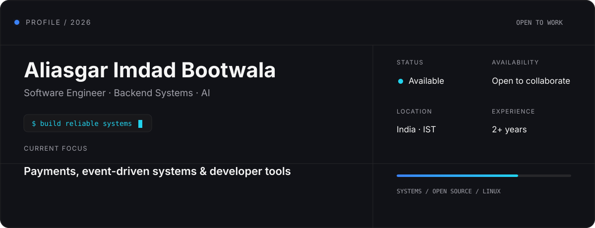
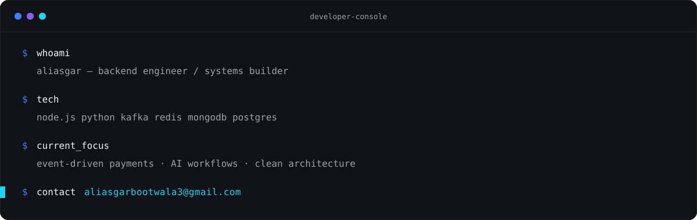
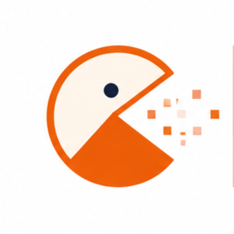
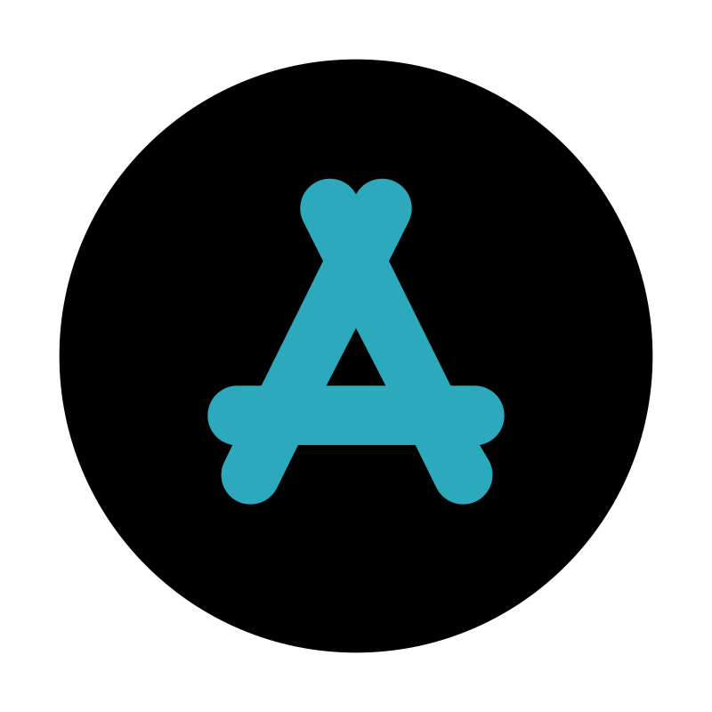
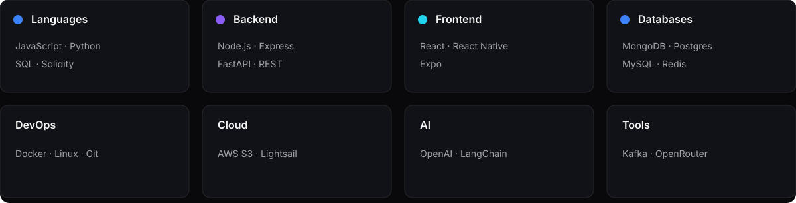
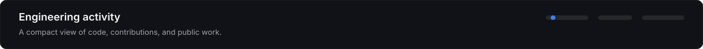
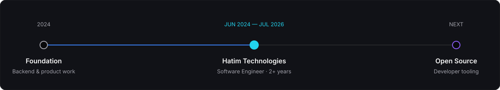

  

BACKEND ENGINEERING · AI SYSTEMS · OPEN SOURCE · LINUX

## About

Backend engineer building reliable payment infrastructure, developer tooling, and AI-assisted products.
I work across distributed systems, event-driven architecture, and pragmatic developer experience.
Experienced in shipping systems with Node.js, Kafka, Redis, MongoDB, and LLM workflows.

## Featured Work

| Project                                                                                                                                | Stack                                 | Core Architecture & Description                                                                                                                                                                                                | Links                                                                                                                              | Status       |
| :------------------------------------------------------------------------------------------------------------------------------------- | :------------------------------------ | :----------------------------------------------------------------------------------------------------------------------------------------------------------------------------------------------------------------------------- | :--------------------------------------------------------------------------------------------------------------------------------- | :----------- |
| <table><tr><td></td><td>**PSP**</td></tr></table>             | `Node.js` `Kafka` `Redis`       | Unified 5 payment gateways with a zero-code configuration-driven adapter system. Automated transaction pipelines via Kafka queues, DLQs, and batch processing (50 msgs/batch). Includes Webhook-driven NFT minting on Polygon. | [GitHub](https://github.com/1129Aliasgar)                                                                                          | `Production` |
| <table><tr><td></td><td>**Aligator**</td></tr></table>       | `Node.js` `MongoDB`                | AI-assisted MongoDB migration tool detecting schema drift between Mongoose models and live DBs. Built-in interactive dry runs, structural rollbacks, and automated cloud schema backups.                                       | [Source](https://github.com/1129Aliasgar/aligator-mongo-migrate) · [npm](https://www.npmjs.com/package/@aliasgarbootwala/aligator) | `Published`  |
| <table><tr><td></td><td>**OpenBrowser**</td></tr></table> | `TypeScript` `Fastify` `SSE`    | Local-first AI agent bridging the terminal and Chrome via an MV3 extension. Uses an SSE stream server to parse, validate via Zod, and safely inject code diffs without manual copying.                                         | [Source](https://github.com/1129Aliasgar/OpenBrowser)                                                                              | `Active`     |
| <table><tr><td></td><td>**App**</td></tr></table>                 | `React Native` `Expo` `GoMLKit` | Production cross-platform mobile application utilizing Google ML Kit and OCR engines to automate real-time inventory tracking, package barcode scanning, and metrics coordination for warehouse clients.                       | [GitHub](https://github.com/1129Aliasgar)                                                                                          | `Production` |

## Technology Stack

## GitHub Analytics

<table width="100%"><tr>
  <td width="50%"></td>
  <td width="50%"></td>
</tr><tr>
  <td width="50%"></td>
  <td width="50%"></td>
</tr></table>

  <a href="https://github.com/1129Aliasgar?tab=repositories">Repositories</a> ·
  <a href="https://github.com/1129Aliasgar?tab=followers">Followers</a> ·
  <a href="https://github.com/1129Aliasgar?tab=repositories&q=&type=source&language=&sort=stargazers">Pinned work</a> ·
  <a href="https://github.com/1129Aliasgar?tab=overview">Contributions</a>

## Current Focus

| Learning                  | Building                    | Reading                               | Exploring           | Goal                    |
| :------------------------ | :-------------------------- | :------------------------------------ | :------------------ | :---------------------- |
| Distributed-system design | Better payment abstractions | Designing Data-Intensive Applications | Agent workflows     | Ship useful open source |
| `Kafka` `system design`   | `AI` `developer tools`      | `architecture`                        | `LLM orchestration` | `quality × leverage`    |

## Experience

## Now Building

| Project & Role | Stack & Progress Tracker |
| :--- | :--- |
| **OpenBrowser** Local-first AI coding assistant | <code>████████░░</code> **80%**&nbsp;&nbsp;&nbsp;&nbsp;&nbsp;&nbsp;&nbsp;&nbsp;&nbsp;&nbsp;&nbsp;&nbsp;&nbsp;&nbsp;&nbsp;&nbsp;&nbsp;&nbsp;&nbsp;&nbsp;&nbsp;&nbsp;&nbsp;&nbsp;&nbsp;&nbsp;&nbsp;&nbsp;&nbsp;&nbsp;&nbsp;&nbsp;&nbsp;&nbsp;&nbsp;&nbsp;&nbsp;&nbsp;&nbsp;&nbsp;&nbsp;&nbsp;&nbsp;&nbsp;&nbsp;&nbsp;&nbsp;&nbsp;&nbsp;&nbsp;&nbsp;&nbsp;&nbsp;&nbsp;&nbsp;&nbsp;&nbsp;&nbsp; Chrome MV3 · Fastify · SSE · Zod · LLM agents · ETA: iterative public releases |

  <a href="https://github.com/1129Aliasgar">GitHub</a>&nbsp;&nbsp;·&nbsp;&nbsp;
  <a href="https://www.linkedin.com/in/aliasgar-bootwala-22b4a8308/">LinkedIn</a>&nbsp;&nbsp;·&nbsp;&nbsp;
  <a href="mailto:aliasgarbootwala3@gmail.com">Email</a>

Aliasgar Imdad Bootwala · Engineer focused on systems that stay understandable as they scale.

